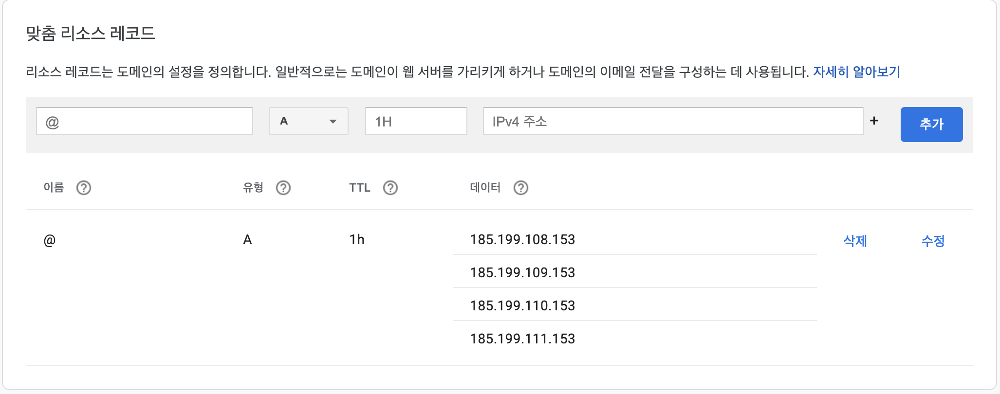

한 동안 방치해두었던 Hexo로 된 기술블로그와 신변잡기와 기술블로그가 섞인 wordpress 블로그를 병합하고,
gatsby로 블로그 플랫폼을 변경 후 깃헙에 정적페이지로 호스팅하는 과정에 대해 적어보고자 한다.

## 1. 블로그 병합의 이유?
* 디지털오션에 wordpress 환경 설정을 하여 블로그를 운영하였으나 신변잡기 위주의 블로그였으며 
간헐적으로 mysql이 죽어버려 안정성이 떨어졌다. 
* Hexo도 gatsby처럼 js기반이면서 md로 작성하면 정적 파일로 생성해주는 장점이 있었으나 배포가 다소 불편하였다.
* 블로그를 두 개로 운영하다보니 업데이트도 자주하지 못하였다.
* 단순히 정적 사이트로 블로그를 운영할 것이라면 깃헙 페이지를 사용하는 것이 좋다고 생각하였다.

## 2. 왜 gatsby를 선택하였을까?
gatsby는 React 기반 정적 사이트 생성툴이다.
사내에서 Vue를 사용하고 있으므로 Vue 기반으로 된 정적 사이트 생성툴도 찾아보았다. 
Vuepress는 블로그보다는 개발 문서를 만들기에 적합해 보였고, 
gridsome은 최근에 업데이트가 잘 되지 않고 있었다.

그래서 gatsby를 선택한 이유는 아래와 같다.
* 업데이트가 지속적으로 잘 되고 있다.
* 커뮤니티가 잘 되어 있다.
* 다양한 Starter가 있다.

나는 [gatsby-casper](https://www.gatsbyjs.com/starters/scttcper/gatsby-casper)라는 Starter를 골랐다. Starter를 사용하지 않고 직접 하나씩 만들어도 된다.

## 3. gatsby 설치 및 환경 설정
* 설치
~~~ bash
npm install -g gatsby-cli
~~~

* Starter 생성
~~~ bash
gatsby new [사용할 디렉토리 명] [설치 할 스타터 링크]
~~~

* 실행
~~~ bash
cd [만들어 놓은 디렉토리]
gasby develop
~~~

* 웹 사이트에 대한 기본 정보는 `website-config.js` 에서 수정한다. 
만약 Starter가 TypeScript로 되어 있다면 `website-config.ts`를 수정하면 된다.

* 댓글 추가
  * 댓글 기능은 깃헙 계정을 사용하는 [utterances](https://utteranc.es/)를 사용하면 된다.
  * 댓글을 작성하면 해당 블로그가 있는 깃헙 레포지토리에 이슈로 등록이 된다.
  * 블로그에 어울리는 테마는 utterances 사이트에서 설정할 수 있다. 
  * 해당 기능 추가는[Gatsby 로 블로그 만들기 (4) (최종)](https://velog.io/@iamchanii/build-a-blog-with-gatsby-and-typescript-part-4)을 참고하였다. 
  이 글에 따르면 React는 `<script>` 안의 소스를 그대로 사용하지 못하고 댓글 컴포넌트를 별도로 작성해야 한다고 한다.
  댓글 컴포넌트 추가에 대한 설명이 잘 되어 있어서 React를 잘 모르는 나도 쉽게 추가하였다. 
* 구글 애널릭틱스는 `gatsby-config.js`에서 ga설정을 해주면 블로그 통계를 확인할 수 있다. 
## 4. 각 블로그 데이터 정제 작업
* Hexo에서 작성한 글들은 이미 markdown으로 작성되어 있어 [프론트매터](https://jekyllrb.com/docs/front-matter/)만 수정하였다. 
* wordpress에서 작성한 글은 markdown으로 내보내기 위해서는 몇 가지 절차를 거쳐야한다.
  * 먼저 관리자로 로그인해서 내보내기로 XML데이터로 내보낸다. 
  * [WordPress to Hugo Exporter](https://github.com/SchumacherFM/wordpress-to-hugo-exporter)를 사용해서 XML데이터를 markdown으로 변환시켜준다.
  * 한글로 되어 있는 파일명을 알아서 영문으로 바꿔주기는 하는데 SEO에 맞지 않으므로 하나하나씩 수정해준다. 
  * [프론트매터](https://jekyllrb.com/docs/front-matter/) 역시 gatsby에서 요구하는 형식과는 다르므로 수정해준다.
## 5. 깃헙페이지에 배포하기
* 변환된 markdown 파일들을 html로 변환해주는 경로에 넣어준다. 내가 선택한 스타터의 경우 `/src/content` 가 해당 경로다.
* 깃헙에 `username.github.io`라고 레포지토리를 만든다. 
* 위에서 만들어놓은 레포지토리를 원격 저장소로 설정한다. `master` 또는 `main`에는 개발소스가 존재하게 된다.
* 깃헙에 자동으로 배포해주는 `gh-pages`를 설치한다. 
~~~ bash
npm install gh-pages --save-dev
~~~

* 배포 관련 스크립트를 `package.json`에 작성한다.
~~~ javascript
{
  "script": {
    "deploy": "gatsby build --prefix-paths && gh-pages -d public"
  }
}
~~~
* 작성 후 배포 명령어를 실행한다.
~~~ bash
npm run deploy
~~~
* 배포 설정한 레포지토리에 `gh-pages`라는 브랜치가 생성되었는지 확인해 본다. 이 브랜치에는 deploy 결과물이 들어가게 된다.
*  username.github.io > settings > pages > source에서 `gh-pages`로 브랜치를 바꿔준다. 
* `https://username.github.io` 를 웹 브라우저 주소창에 입력하여 블로그가 잘 보이는지 확인해 본다.
## 6. 커스텀 도메인 사용하기
* 먼저 소유하고 있는 도메인의 사이트에서 깃헙에 해당하는 리소스 레코드를 수정해준다. 
나의 경우는 구글 도메인을 사용하고 있으며, 아래와 같이 설정하였다. 
  * DNS 메뉴로 이동 후 맞춤 리소스 레코드를 수정해준다. 
  
  * 깃헙에서 username.github.io 레포지토리 > settings > pages > custom domain으로 이동하여 사용할 도메인을 적어준다.
  * 위 작업을 하고 나면 자동으로 CNAME이 생성되고 커스텀 도메인으로 블로그에 접근할 수 있게 된다. 

## 7. 소소하지만 수정해야 할 것
* 프론트메타에서 `draft: true` 라고 모든 markdown문서에 쓰여있으면 에러가 발생하는데 이 부분에 대한 예외처리가 필요할 듯 하다. 
스타터 자체에 해당 내용이 없어서 깊게 고민해야 할듯.
* 아직 준비 중인 페이지가 좀 있다.
* 로고도 아직은 스타터 기본 로고이다.

몇 년 전부터 준비해온 블로그 병합, 개편을 마치고 나니 밀린 숙제를 해결한 기분이다.
앞으로는 꾸준히 개발하면서 알게 된 부분에 대해서 적어봐야겠다. 

## 참고링크
* [gatsby 공식문서](https://www.gatsbyjs.com/docs/)
* [gatsby 스타터](https://www.gatsbyjs.com/starters/?)
* [댓글 추가](https://velog.io/@iamchanii/build-a-blog-with-gatsby-and-typescript-part-4)
* [데이터 정제 작업](https://blog.aliencube.org/ko/2020/01/03/migrating-wordpress-to-gridsome-on-netlify-through-github-actions/) 
* [깃헙페이지 배포](https://www.gatsbyjs.com/docs/how-to/previews-deploys-hosting/how-gatsby-works-with-github-pages/)
